# RAR Woo Smart Courier Pro

      

Multi-courier shipping and dispatch for WooCommerce stores in Bangladesh. It gives customers one courier choice per company at checkout, each with a price, a delivery time and an estimated arrival date. Behind the scenes it gives your team a dispatch board, parcel labels, hand-over manifests, tracking and a courier performance dashboard.

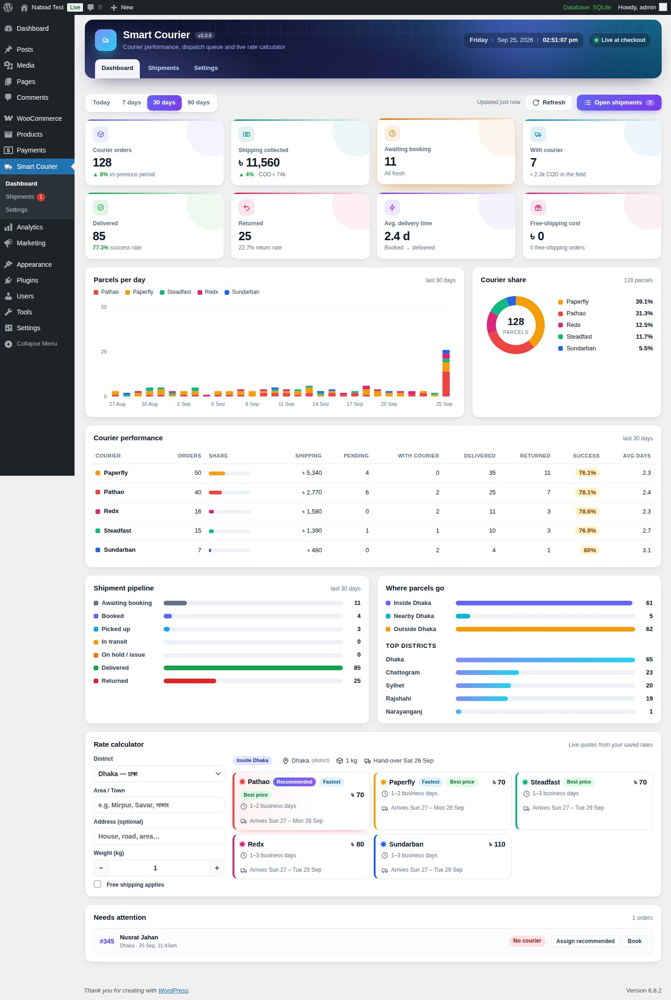

## Download

### [⬇️ Download RAR Woo Smart Courier v2.0.0 (installable ZIP)](https://github.com/ruhulaminrevens/RAR-Woo-Smart-Courier-Pro/raw/main/releases/rar-woo-smart-courier-v2.0.0.zip)

- **Installable ZIP:** [`releases/rar-woo-smart-courier-v2.0.0.zip`](releases/rar-woo-smart-courier-v2.0.0.zip). Upload this file to WordPress.
- **Source code:** [Download the repository as ZIP](https://github.com/ruhulaminrevens/RAR-Woo-Smart-Courier-Pro/archive/refs/heads/main.zip). This is for developers; don't upload it to WordPress.

### Install in 1 minute

1. Take a **full backup** of your site (files + database).
2. WordPress → **Plugins → Add New → Upload Plugin** → choose `rar-woo-smart-courier-v2.0.0.zip` → **Install Now** → **Activate**.
3. **Already using v1.x?** Choose **Replace current with uploaded**. Your settings and older orders are converted automatically; see [Upgrading from 1.x](#upgrading-from-1x).
4. Open **Smart Courier → Settings**, enter your courier rates, and test with **Safe Test Mode ON** before going live.

The plugin shows up in WordPress as **RAR Woo Smart Courier**. It keeps the same plugin folder (`rar-woo-smart-courier`) as v1.x, so it upgrades your existing installation in place. The full checklist is in [docs/INSTALLATION.md](docs/INSTALLATION.md).

## What's new in 2.0

- **Correct Dhaka detection.** v1.x compared the address against the word "Dhaka". WooCommerce actually stores districts as codes such as `BD-13`, so every order got the "Outside Dhaka" rate. v2 understands WooCommerce codes, English and বাংলা district names, and common old spellings (Chittagong, Comilla, Jessore…).
- **Correct weights.** Product weights are converted from g, lbs or oz to kg. v1.x treated 500 g as 500 kg.
- **Nearby areas win over "Dhaka".** Savar, Ashulia, Keraniganj and similar areas get the Nearby rate even when the customer picks Dhaka district. The area name can come from the city or the address line.
- **Works with HPOS and the Cart/Checkout blocks.** This is declared to WooCommerce and tested with both order storage modes.
- **New:**
  - Courier dashboard
  - Shipments board
  - Tracking numbers and statuses
  - Customer tracking
  - Parcel labels with barcodes
  - Hand-over manifests
  - CSV export
  - Estimated delivery dates
  - Badges at checkout
  - Unlimited custom couriers

## Features

### Checkout

- One option per enabled courier. Each shows its price and delivery time, plus an **estimated arrival date** such as "Arrives Sun 27 – Mon 28 Sep". The date skips your weekly off-days and holidays and respects your same-day cut-off time.
- Badges: **Recommended**, **Fastest** and **Best price**. The recommended courier is listed first and pre-selected.
- Three recommendation modes:
  - **Smart:** fastest, then cheapest, then your priority.
  - **Cheapest first.**
  - **My priority.**
- Three zones: Inside Dhaka, Nearby Dhaka and Outside Dhaka.
  - The Nearby districts are configurable (default Gazipur and Narayanganj).
  - So are the Nearby areas inside Dhaka district (Savar, Ashulia, Keraniganj, Dohar, Dhamrai, Nawabganj, with English and বাংলা names).
  - There is an optional list of areas that should always count as "Inside Dhaka" (e.g. Tongi).
- Weight pricing uses three prices per zone: up to 1 kg, up to 2 kg, then an extra charge for every started kg above 2 kg. There is a fallback weight for products without one and an optional packaging weight.
- Each courier can have a maximum weight and can be turned off for individual zones.
- WooCommerce **Free shipping** keeps working. Either every courier becomes free, or only the recommended one. The normal price is shown struck through.
- Tax on shipping is recalculated for each courier's price. Local pickup stays available.
- Two label styles for the classic checkout: detailed or compact. The Checkout block shows the name, badge, price, delivery time and date.
- **Safe Test Mode.** While it is on, only shop managers see the couriers.

### Dispatch

- **Shipments board** with tabs: Ready to book · With courier · Booked · Picked up · In transit · On hold · Delivered · Returned · No courier · All.
  - Search by order, name, phone, tracking number or area. Filter by courier, zone and period.
  - Change the courier, tracking number and status inline.
  - Type a tracking number and press **Enter**. The parcel is saved as **Booked** and the cursor jumps to the next row.
  - Bulk actions: set courier, set status, print labels, manifest, CSV.
  - The details drawer shows items, notes and the shipment timeline. **Copy parcel info** gives you text to paste into a courier merchant panel.
- **Parcel labels** with a Code 128 barcode. Sizes: A4 (8 per page), 4×6 in thermal or A6. Each label shows the COD amount, recipient, phone, address, district, zone, item count, weight and sender.
- **Hand-over manifest** grouped by courier, with COD and weight totals and signature lines.
- **CSV export**, UTF-8 so Bangla text opens correctly in Excel, with spreadsheet-formula protection.
- **Order screen:**
  - A Smart Courier box to set the courier (or "Recommended"), tracking number, status and note. It also shows a progress bar, timeline and label link.
  - A Courier column in the orders list, with courier and shipment-status filters.
  - Bulk actions in the orders list.

### Automation & customers

- Orders created by phone, from the admin, or with the **RAR Woo Stock & Order** staff app are auto-assigned the recommended courier when they reach a "ready" status.
- The customer is emailed when a tracking number is added. The email is sent as a WooCommerce customer note and includes the tracking link and delivery estimate.
- A delivery card on the thank-you page and in My Account → Orders, with a **Track** button.
- Courier, delivery time and tracking are added to order emails.
- A public tracking page (`[rwsc_tracking]`) where customers enter their order number and phone number. It is rate-limited and a page can be created with one click.
- Optional: mark the order **Completed** when the parcel is delivered, and change the order status when a parcel is returned.

### Dashboard

- Today, 7, 30 or 90 days:
  - courier orders and shipping collected (compared with the previous period)
  - parcels awaiting booking (with a stale warning) and parcels with the courier (COD still to collect)
  - delivered with success rate, returned with return rate
  - average delivery time and the cost of free shipping
- Parcels per day by courier, courier share, a courier performance table, the shipment pipeline, zones and top districts.
- A **rate calculator**: pick a district, area and weight to get live quotes.
- A **Needs attention** list and a **Setup check**. The setup check flags a missing Bangladesh shipping zone, test mode, missing product weights and similar problems.

### Settings (tabbed)

- **Couriers & rates:** colour, priority, tracking-link template (`{tracking}`, `{phone}`, `{order}`), max weight and a zone price matrix. Add or remove custom couriers.
- **Zones & weight:** a district picker for all 64 districts grouped by division, with Bangla names and search; area tags; an address-matching toggle; and an address tester.
- **Checkout display:** engine switch, test mode, recommendation mode, label style, badges, free-shipping mode and a live label preview.
- **Delivery dates:** off-days, cut-off time and holidays, with one click to add the fixed-date national holidays.
- **Tracking & automation**, **COD methods** and **sender details** for labels.
- **Tools:** export and import settings as JSON, reset to defaults, and system status.

## How it works

1. Create a WooCommerce shipping zone for **Bangladesh** with a **Flat rate** method, plus **Free shipping** if you use it. The flat rate is only the anchor: Smart Courier replaces it with one option per courier, using your courier prices.
2. For each package, the plugin:
   - resolves the district and zone from the address;
   - calculates the parcel weight in kg;
   - prices each enabled courier;
   - works out the ETA and delivery date;
   - sorts the couriers and adds badges.
3. The chosen courier is stored on the order: courier, ETA, estimated date, zone, district and weight. The shipment then moves **Awaiting booking → Booked → Picked up → In transit → Delivered / Returned**, or **On hold** when there is a problem.

The plugin does not call courier APIs. You enter the rates from your own courier contracts and book parcels in the couriers' merchant panels. The tracking number, labels, manifest and CSV make that quick.

## Upgrading from 1.x

- Settings are migrated automatically. Nearby district names become WooCommerce codes, "nearby cities" become "nearby areas", and your courier prices and ETAs are kept.
- Orders placed with v1.x receive a courier key and a shipment status in the background: Completed orders are marked Delivered, other orders Awaiting booking. This runs in batches of 100 while an admin is logged in.
- Order data is never deleted. Uninstalling the plugin keeps all settings and order meta.

## Developers

```php
rwsc_get_quotes( array( 'country' => 'BD', 'state' => 'BD-13', 'city' => 'Mirpur' ), 1.5 );   // quotes for 1.5 kg
rwsc_get_shipment( $order );                                                                // courier, tracking, status, ETA…
rwsc_update_shipment( $order, array( 'tracking' => 'ABC123', 'status' => 'booked' ) );
```

- **Filters:**
  - `rwsc_quotes`, `rwsc_courier_cost`, `rwsc_package_weight`, `rwsc_order_weight`
  - `rwsc_base_rate`, `rwsc_package_rates`, `rwsc_pickup_methods`
  - `rwsc_tracking_url`, `rwsc_customer_tracking_message`, `rwsc_shipment_statuses`
  - `rwsc_view_capability`, `rwsc_manage_capability`
- **Actions:** `rwsc_shipment_updated`, `rwsc_shipment_status_changed`, `rwsc_settings_saved`.
- **Order meta:**
  - courier and assignment: `_rwsc_courier`, `_rwsc_selected_courier`, `_rwsc_zone`, `_rwsc_district`, `_rwsc_eta`, `_rwsc_edd`, `_rwsc_weight`
  - shipment: `_rwsc_tracking`, `_rwsc_status`, `_rwsc_note`, `_rwsc_log`
  - timestamps: `_rwsc_booked_at`, `_rwsc_delivered_at`, `_rwsc_returned_at`

## Repository structure

```text
rar-woo-smart-courier.php          Bootstrap, HPOS + blocks compatibility
includes/
  class-rwsc-plugin.php            Orchestrator, upgrade routine
  class-rwsc-settings.php          Defaults, sanitising, migration
  class-rwsc-locations.php         64 districts (codes, Bangla, aliases), zone resolution
  class-rwsc-engine.php            Weight, cost, ETA, delivery dates, quotes, rate filter, labels
  class-rwsc-shipments.php         Shipment model, auto-assign, status/tracking updates, v1 backfill
  class-rwsc-reports.php           SQL reads for dashboard + board (HPOS and legacy)
  class-rwsc-orders-admin.php      Order meta box, list column, filters, bulk actions
  class-rwsc-admin.php             Menus, settings page, health checks
  class-rwsc-ajax.php              Admin AJAX endpoints
  class-rwsc-print.php             Labels (Code 128), manifest, CSV
  class-rwsc-frontend.php          Checkout styles, customer card, emails, tracking shortcode
  functions.php                    Public helper API
assets/css, assets/js              Admin app + storefront styles
languages/                         Translation template
docs/                              Installation guide, screenshots
releases/                          Installable ZIPs
```

## Compatibility

- WordPress 6.2+ · WooCommerce 8.0+ (tested with 10.1) · PHP 7.4+ (tested with 8.4).
- High-Performance Order Storage and legacy posts storage.
- Classic cart and checkout (shortcodes) and the Cart/Checkout blocks.
- Taxes on shipping, WooCommerce Free shipping, Local pickup, and cash on delivery restricted to "Flat rate".

## Screenshots

| | |
|---|---|
| 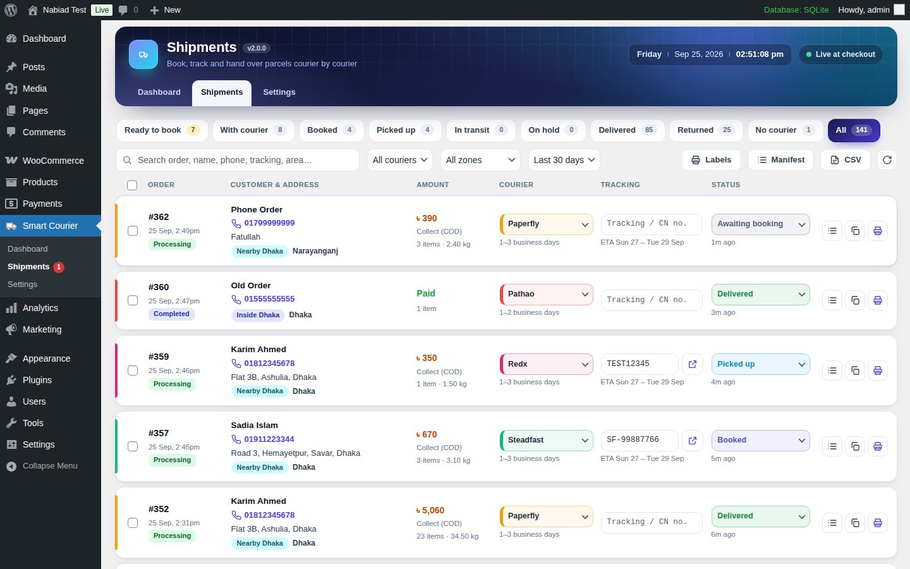 | 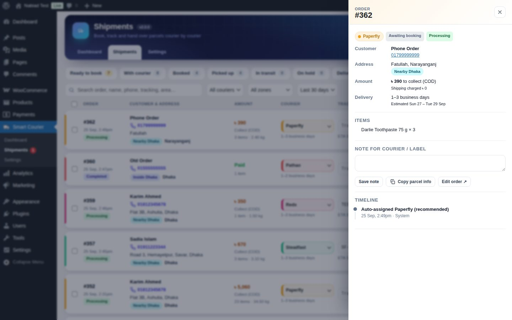 |
| 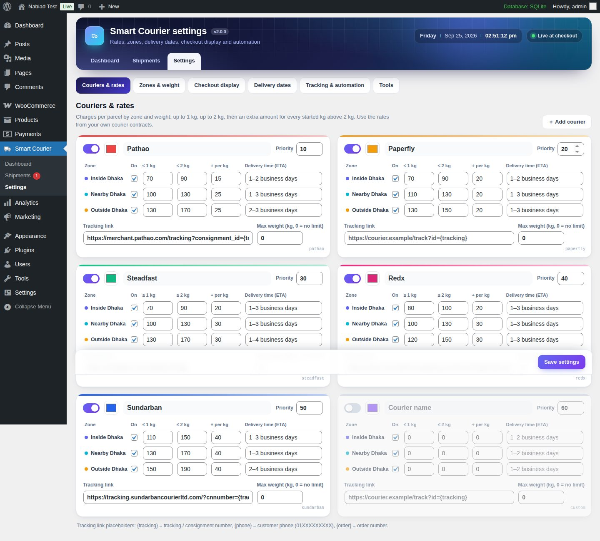 | 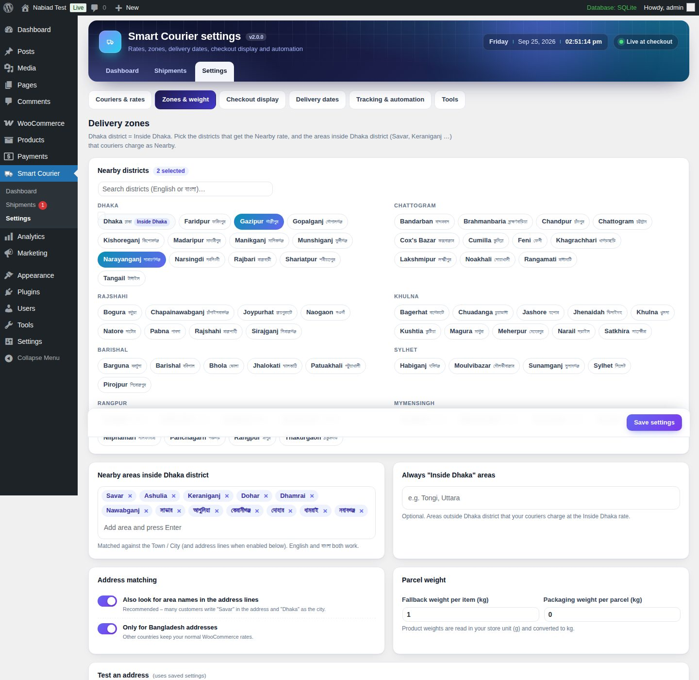 |
| 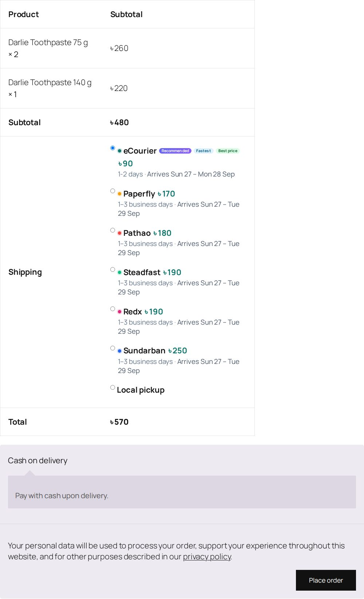 | 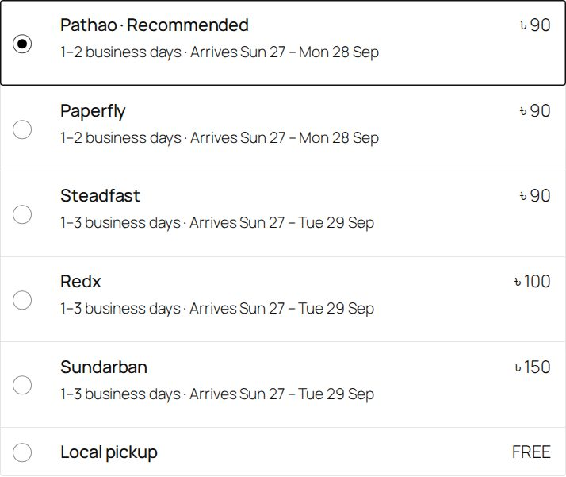 |
| 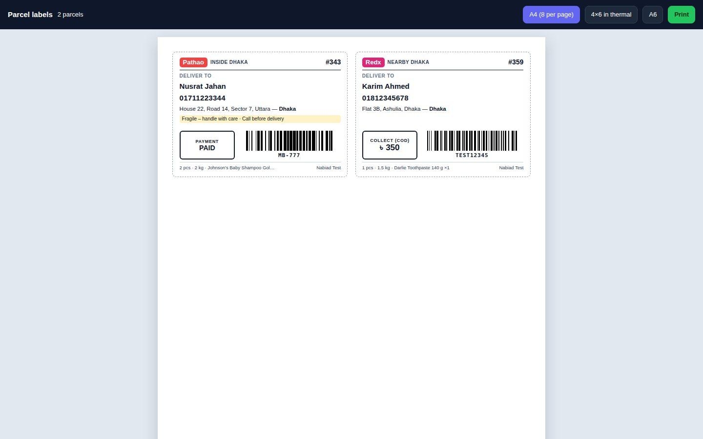 | 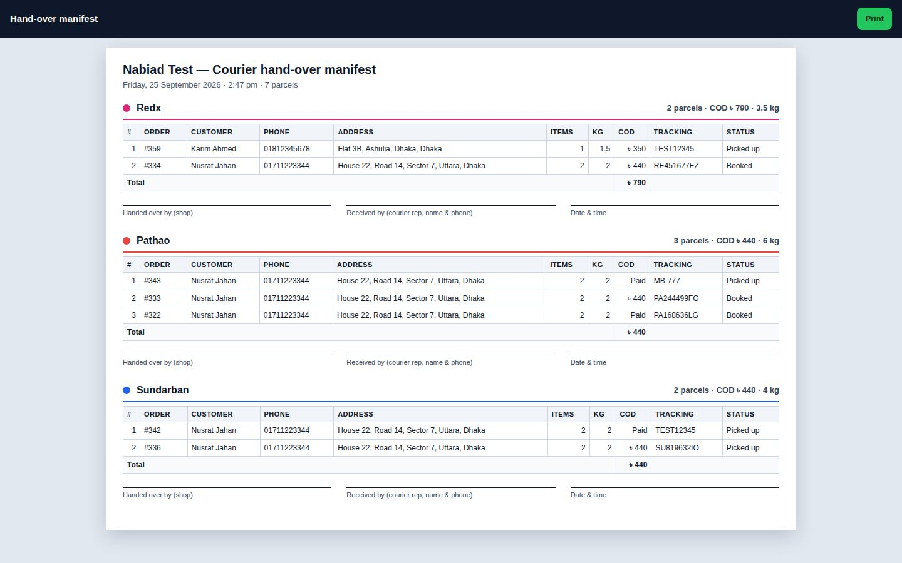 |
| 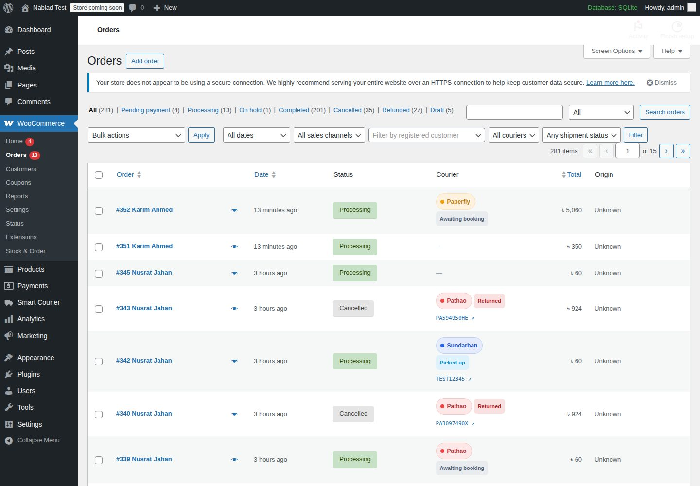 | 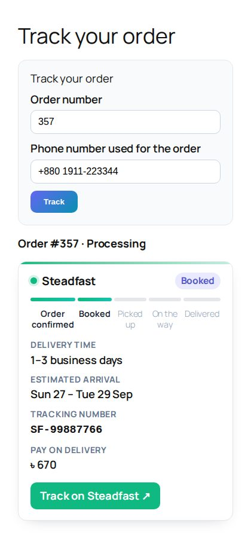 |

## Version

**v2.0.0 — 2026-09-25.** See [CHANGELOG.md](CHANGELOG.md).

## License

GPL-2.0-or-later
